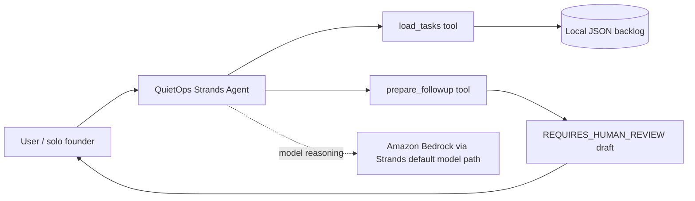

# QuietOps architecture

## Side-effect boundary

`load_tasks` is read-only. `prepare_followup` only packages text and explicitly reports `side_effects: none`. The hackathon demo intentionally stops at human review instead of sending email or mutating an external system.

## What must be verified before submission

The Bedrock arrow is architectural intent until the exact repository code has been run successfully with the entrant's AWS account/model access. The demo and Devpost description must not claim successful Bedrock execution until that test exists.
